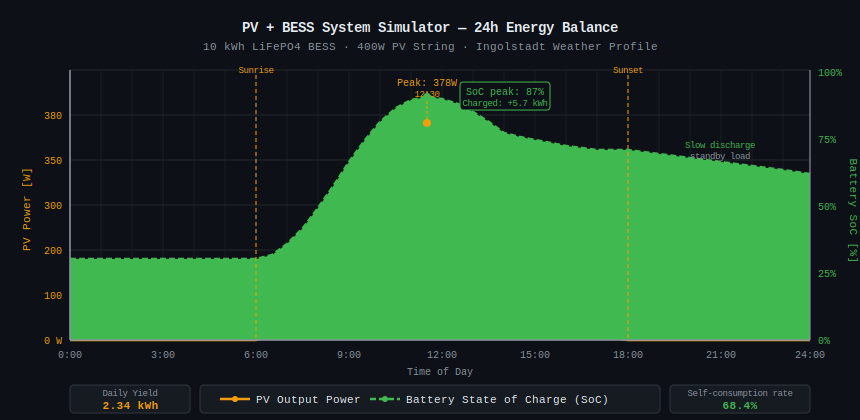

# PV + BESS System Simulator

A C++ simulation of a photovoltaic + battery energy storage system, built as a preparation project for a Praktikum at **BElectric**.

## Motivation

This project connects the theoretical content of the 2nd semester at THWS (BET) directly to real-world energy engineering:

| Course | Topic | Applied In |
|--------|-------|-----------|
| GET2 | Complex impedance, AC power, three-phase | `ACCircuit`, `ThreePhaseGrid` |
| IM4 | ODEs (Euler method), Fourier series, Laplace | `ODESolver`, `SignalProcessor`, `LaplaceFilter` |
| MT2 | Thevenin equivalent, ADC, signal filtering | `Battery`, `ADConverter`, `SignalProcessor` |
| PROG2 | OOP, operator overloading, file I/O, Makefiles | All classes |

## C++ Classes

```
PVPanel        – PV module model (simplified one-diode, MPP, series connection via operator+)
ACCircuit      – AC circuit with complex impedance Z = R + j(ωL - 1/ωC)
Battery        – Thevenin equivalent circuit, SoC management, charge/discharge
ODESolver      – Euler method for RC/RL transient response (IM4)
SignalProcessor – Moving average FIR filter + Fourier coefficients
LaplaceFilter  – RC low-pass H(s)=1/(1+sRC), Bode plot
ThreePhaseGrid – Three-phase power P = √3·U·I·cosφ (GET2 Drehstrom)
ADConverter    – 8/12/16-bit ADC simulation, quantization noise, SNR
```

## Build & Run

```bash
make        # compile
make run    # compile and execute
make clean  # remove binaries
```

Requires: g++ with C++14 support.

## Sample Output

The simulation runs a 24-hour energy balance for a 10 kWh LiFePO4 BESS charged by a 400W PV string. Results are saved to `simulation_output.csv` for plotting.

## Next Steps

- [ ] PVGIS real irradiance data integration (Tag 13)
- [ ] Peak shaving control strategy (Tag 10)
- [ ] Python/matplotlib visualization (Tag 12)
- [ ] Fourier spectrum of daily irradiance profile (Tag 5)

---
*Author: Yelun Zhang | THWS Schweinfurt | BET Semester 2 | 2026*
